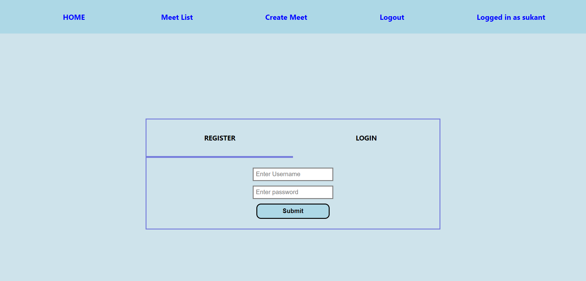
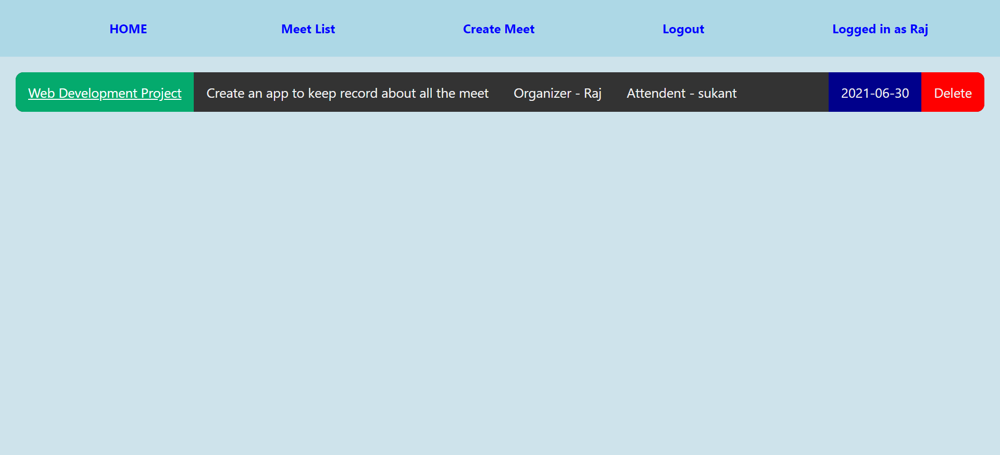
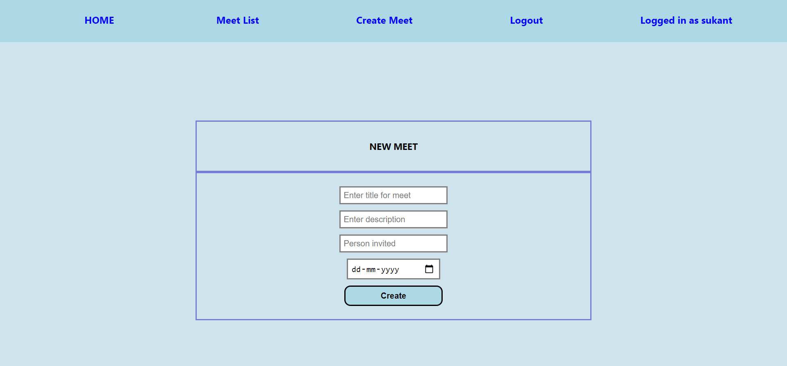

# Meet-List
Keep track of all your meetings

To run the project on your localhost:

1. Download the files and run command “npm i” for node modules.

The starting page gives you the option to register or login :

You can see your meet list on Meet List:

The user can create meet:

